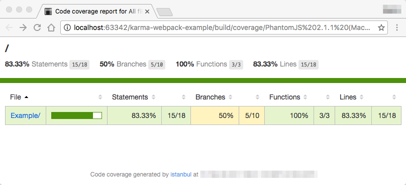

[](https://travis-ci.org/gabel/karma-webpack-example)

# karma-webpack-example

Karma + Webpack + Mocha + Chai + Istanbul

##Installation

```npm install```

## Run

```
npm run test
```

Remove --single-run to keep karma running. It will watch any changes on the test files and rerun instantly.

Output

```
npm test

> karma-webpack-example@1.0.0 test /Users/d060690/karma-webpack-example
> node ./node_modules/karma/bin/karma start --single-run --browsers PhantomJS

Hash: 0ccf6e18f9ce63e40540
Version: webpack 1.14.0
Time: 302ms
       Asset    Size  Chunks             Chunk Names
test/test.js  173 kB       0  [emitted]  test/test.js
chunk    {0} test/test.js (test/test.js) 165 kB [rendered]
    [0] ./test/test.js 99 bytes {0} [built]
    [1] ./test _test$ 197 bytes {0} [built]
    [2] ./test/Example/hexColorLuminance_test.js 597 bytes {0} [optional] [built]
    [3] ./~/chai/chai.js 159 kB {0} [built]
    [4] ./src/Example/hexColorLuminance.js 5.08 kB {0} [built]
    [5] (webpack)/buildin/amd-options.js 43 bytes {0} [built]

WARNING in ./~/chai/chai.js
Critical dependencies:
1:477-484 This seems to be a pre-built javascript file. Though this is possible, it's not recommended. Try to require the original source to get better results.
 @ ./~/chai/chai.js 1:477-484
03 02 2017 08:31:17.038:INFO [karma]: Karma v1.4.1 server started at http://0.0.0.0:9876/
03 02 2017 08:31:17.044:INFO [launcher]: Launching browser PhantomJS with unlimited concurrency
03 02 2017 08:31:17.067:INFO [launcher]: Starting browser PhantomJS
03 02 2017 08:31:18.045:INFO [PhantomJS 2.1.1 (Mac OS X 0.0.0)]: Connected on socket yME3wmuxdm0t5GHIAAAA with id 92073047

  hexColorLuminance
    ✓ should return a luminanced color
    ✓ should change the background of an element

PhantomJS 2.1.1 (Mac OS X 0.0.0): Executed 2 of 2 SUCCESS (0.02 secs / 0.002 secs)
TOTAL: 2 SUCCESS


-----------------------|----------|----------|----------|----------|----------------|
File                   |  % Stmts | % Branch |  % Funcs |  % Lines |Uncovered Lines |
-----------------------|----------|----------|----------|----------|----------------|
 Example/              |    83.33 |       50 |      100 |    83.33 |                |
  hexColorLuminance.js |    83.33 |       50 |      100 |    83.33 |       10,14,17 |
-----------------------|----------|----------|----------|----------|----------------|
All files              |    83.33 |       50 |      100 |    83.33 |                |
-----------------------|----------|----------|----------|----------|----------------|


=============================== Coverage summary ===============================
Statements   : 83.33% ( 15/18 )
Branches     : 50% ( 5/10 )
Functions    : 100% ( 3/3 )
Lines        : 83.33% ( 15/18 )
================================================================================
```

## Gulp

added usage in a gulp scenario

try it via "npm run test-gulp" or simply "gulp" in the
projects directory if you have gulp installed globally

## Istanbul Coverage

